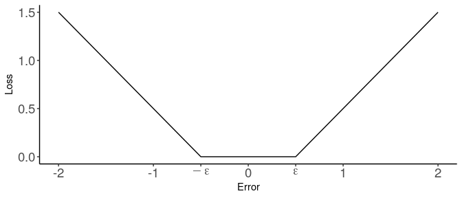

l1svr: An R Package for Support Vector Regression under l1
Regularization
================
Yuehao Bai, Hung Ho, Guillaume Pouliot, and Joshua Shea

  - [Introduction](#introduction)
  - [Installation and Requirements](#installation-and-requirements)
      - [Basic estimation and
        inference](#basic-estimation-and-inference)
      - [Constructing confidence
        intervals](#constructing-confidence-intervals)
  - [Help, Feature Requests and Bug
    Reports](#help-feature-requests-and-bug-reports)
  - [References](#references)

## Introduction

The **l1svr** package allows the user to estimate and perform
statistical inference for support vector regressions under l1
regularization (l1-SVR). This vignette documents package installation
and requirements, and demonstrates how the package may be used. We refer
the reader to Bai et al. (2021) for technical details on how the
estimation and inference are carried out.

## Installation and Requirements

<!-- **l1svr** can be installed from CRAN via -->

<!-- ```{r eval = FALSE} -->

<!-- install.packages("l1svr") -->

<!-- ``` -->

The latest version of the module may be installed from our GitHub
repository using the **devtools** package.

``` r
devtools::install_github("jkcshea/l1svr")
```

A package for solving linear programs is required. The user can choose
from three options.

1.  Gurobi and the Gurobi R package **gurobi**, which can be obtained
    from [Gurobi Optimization](http://www.gurobi.com/index). This option
    requires a Gurobi software license, which Gurobi Optimization offers
    at no cost to academic researchers.

2.  CPLEX and the package **cplexAPI**, which is available on CRAN.
    CPLEX can be obtained from
    [IBM](https://www.ibm.com/analytics/cplex-optimizer). This option
    requires a software license, which IBM offers at no cost to academic
    researchers.

3.  The **lpSolveAPI** package, which is free and open-source, and
    available from CRAN. Note that **lpSolveAPI** is a wrapper for
    [lp\_solve](http://lpsolve.sourceforge.net/5.5/), which is no longer
    actively developed.

We *strongly* recommend using Gurobi or CPLEX, since these are actively
developed, much more stable, and typically an order of magnitude faster
than **lpSolveAPI**. A very clear installation guide for Gurobi can be
found
[here](https://cran.r-project.org/package=prioritizr/vignettes/gurobi_installation.html)

### Basic estimation and inference

In support vector regressions, the parameters of a linear regression
model are estimated by minimizing a loss function that linearly
penalizes the errors exceeding a threshold `epsilon`, as depicted in the
figure below.



The l1-norm regularization includes an additional penalty proportional
to the l1-norm of the coefficient estimates. The extent of the
regularization is controlled by the tuning parameter `lambda`, which
scales the l1-penalty on the coefficient estimates.

The package includes the data set `simdata`, which we will use to
demonstrate the features of the package.

``` r
library(l1svr)
knitr::kable(head(simdata))
```

|          y |        x1 |          x2 |
| ---------: | --------: | ----------: |
|  12.950682 | 2.1281398 |   0.4447571 |
|   3.832256 | 0.6019315 |   3.5944270 |
|   8.415657 | 5.1510226 |   4.7557135 |
|  12.293254 | 2.4941418 |   3.6132991 |
| \-3.457342 | 1.2373849 | \-0.0378572 |
|   2.740720 | 2.1897245 | \-1.8182690 |

To estimate a linear regression model using the **l1svr** package, the
user must pass a data set, a regression equation, a bandwidth `epsilon`,
and a tuning parameter `lambda` to the function `l1svr`. The user may
also choose which solver to use by setting the `solver` argument to
`'gurobi'`, `'cplexapi'`, or `'lpsolveapi'`. By default, `solver =
'gurobi'`.

``` r
fit1 <- l1svr(formula = y ~ 1 + x1 + x2,
              data = simdata,
              epsilon = 7,
              lambda = 20,
              solver = 'gurobi')
summary(fit1)
#> 
#> Call:
#> l1svr(formula = y ~ 1 + x1 + x2, data = simdata, epsilon = 7, 
#>     lambda = 20, solver = "gurobi")
#> 
#> Coefficient estimates:
#>               Estimate     Pr(>|t|)    
#> (Intercept) -0.7156648 0.1839101152    
#> x1           0.9467390 0.0000065977 ***
#> x2           0.1046828 0.3230624765    
#> ---
#> Signif. codes:  0 '***' 0.001 '**' 0.01 '*' 0.05 '.' 0.1 ' ' 1
```

The coefficient estimates are stored in the entry `$coefficients` of the
output, and the p-values are stored in the entry `$pvalues`. By default,
statistical inference is performed assuming that the errors are
homoskedastic.

Inference under heteroskedasticity is also possible, but requires the
density of the errors to be estimated. To enable this feature, the user
must provide the additional tuning parameters needed for density
estimation. The **l1svr** package estimates the density of the errors
using the procedure described in Powell (1991), which involves two
positive scalar tuning parameters, `h` and `kappa`. They determine the
bandwidth used for density estimation, and the bandwidth is increasing
in both parameters. The parameter `h` determines the quantiles of a
standard normal distribution used to define the bandwidth, and the
parameter `kappa` directly scales the bandwidth. Inference under
heteroskedasticity will not be performed unless both `h` and `kappa` are
passed. We refer the reader to the Online Appendix of Bai et al. (2021)
for additional details on how inference is performed under
heteroskedasticity.

``` r
fit2 <- l1svr(formula = y ~ 1 + x1 + x2,
              data = simdata,
              epsilon = 7,
              lambda = 20,
              h = 2,
              kappa = 1.75)
summary(fit2)
#> 
#> Call:
#> l1svr(formula = y ~ 1 + x1 + x2, data = simdata, epsilon = 7, 
#>     lambda = 20, h = 2, kappa = 1.75)
#> 
#> Coefficient estimates:
#>               Estimate     Pr(>|t|)    
#> (Intercept) -0.7156648 1.807746e-01    
#> x1           0.9467390 1.399828e-05 ***
#> x2           0.1046828 3.471127e-01    
#> ---
#> Signif. codes:  0 '***' 0.001 '**' 0.01 '*' 0.05 '.' 0.1 ' ' 1
```

If desired, the user may turn off the inference procedure by setting
`inference = FALSE`.

### Constructing confidence intervals

The `l1svr` function is able to construct confidence intervals by
inverting the test procedure. This entails the function implementing the
l1-SVR regression rankscore test under a sequence of null hypotheses for
each coefficient estimate. The end points of the confidence interval
correspond to the null hypotheses under which the p-value of the test
statistic is equal to the size of the test, up to some tolerance. This
is a computationally intensive procedure and is disabled by default.

To enable the estimation of confidence intervals, set the argument
`confidence.level` to a value between 0 and 1. As its name indicates,
this argument also determines the confidence level of the intervals. The
iterative procedure will terminate when the difference between the
p-value of the endpoints of the confidence interval and the size of the
test (`1 - confidence.level`) is within the level of tolerance. By
default, the tolerance is equal to `1e-3`, but can be adjusted using the
argument `confidence.tol`. The maximum number of iterations performed
may also be set using `confidence.iter`. In the example below, the
confidence intervals are constructed assuming that the errors are
homoskedastic.

``` r
fit3 <- l1svr(formula = y ~ 1 + x1 + x2,
              data = simdata,
              epsilon = 7,
              lambda = 20,
              confidence.level = 0.95,
              confidence.iter = 20,
              confidence.tol = 2e-3)
#> 
#> Estimating confidence interval for (Intercept)...
#> Estimating confidence interval for x1...
#> Estimating confidence interval for x2...
#> Warning: Estimation for some confidence intervals was terminated, iteration
#> maximum reached.
summary(fit3)
#> 
#> Call:
#> l1svr(formula = y ~ 1 + x1 + x2, data = simdata, epsilon = 7, 
#>     lambda = 20, confidence.level = 0.95, confidence.iter = 20, 
#>     confidence.tol = 0.002)
#> 
#> Coefficient estimates:
#>               Estimate     Pr(>|t|)    
#> (Intercept) -0.7156648 0.1839101152    
#> x1           0.9467390 0.0000065977 ***
#> x2           0.1046828 0.3230624765    
#> ---
#> Signif. codes:  0 '***' 0.001 '**' 0.01 '*' 0.05 '.' 0.1 ' ' 1
#> 
#> 95% confidence intervals:
#>                     Lower     Upper   
#> (Intercept)    -2.0570935 0.7156648 * 
#> x1              0.6630253 1.5620735   
#> x2           * -0.4072003 0.7066094   
#> ---
#> Conf. interval codes:
#> '*'  Iteration limit reached
#> '**' Precision limit reached
```

In the example above, the user is informed that the estimation of some
of the confidence intervals has been terminated before the p-value at
the endpoints are within tolerance to the size of the test since the
iteration limit was reached. The estimated confidence interval may
therefore not reflect the confidence level set by the user. In addition
to warning the user of these instances, the function returns the
p-values at the end points of each confidence interval in the entry
`$ci` of the output, along with details on the iterative procedure.

``` r
fit3$ci
#> $lower
#>                  bound     pvalue iterations      status
#> (Intercept) -2.0570935 0.04868917          5     Optimal
#> x1           0.6630253 0.05148304          9     Optimal
#> x2          -0.4072003 0.05802900         20 Iter. limit
#> 
#> $upper
#>                 bound     pvalue iterations      status
#> (Intercept) 0.7156648 0.04610914         20 Iter. limit
#> x1          1.5620735 0.04842687          9     Optimal
#> x2          0.7066094 0.04850169          7     Optimal
#> 
#> $level
#> [1] 0.95
#> 
#> $tol
#> [1] 0.002
#> 
#> $heteroskedastic
#> [1] FALSE
```

Another reason that the estimation of confidence intervals may terminate
prematurely is that the estimated endpoints across successive iterations
have become sufficiently small. This implies that the solver is unable
to perform the test at the level of precision required for the p-value
of the bound to fall within tolerance to the size of the test. The user
can try to avoid this by reducing `confidence.same`, which sets the
tolerance level determining whether two bounds from successive
iterations of the procedure are sufficiently close. By default, this
parameter is equal to `1e-06`. However, since the limitation pertains to
the solver, there is no guarantee that reducing this parameter will
improve the estimate of the confidence intervals.

## Help, Feature Requests and Bug Reports

Please post an issue on the [GitHub
repository](https://github.com/jkcshea/l1svr/issues).

## References

<div id="refs" class="references">

<div id="ref-bai2021inference">

Bai, Yuehao, Hung Ho, Guillaume A. Pouliot, and Joshua Shea. 2021.
“Inference for Support Vector Regression under l1 Regularization.” In
*AEA Papers and Proceedings*.

</div>

<div id="ref-powell1991estimation">

Powell, James L. 1991. “Estimation of Monotonic Regression Models Under
Quantile Restrictions.” *Nonparametric and Semiparametric Methods in
Econometrics*, 357–84.

</div>

</div>
